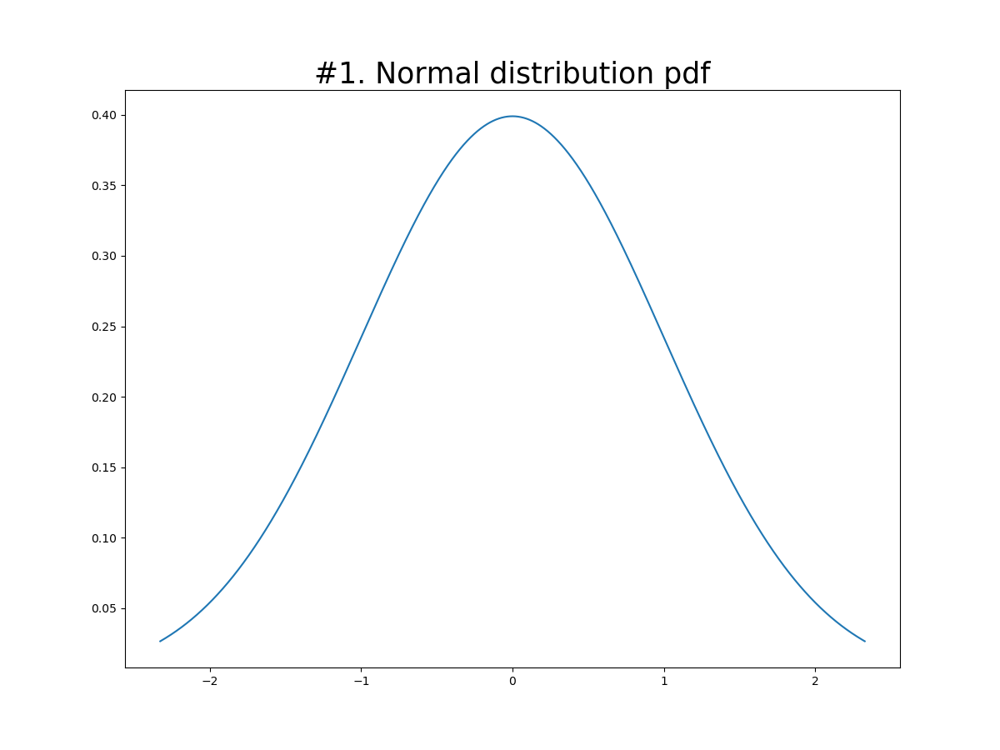
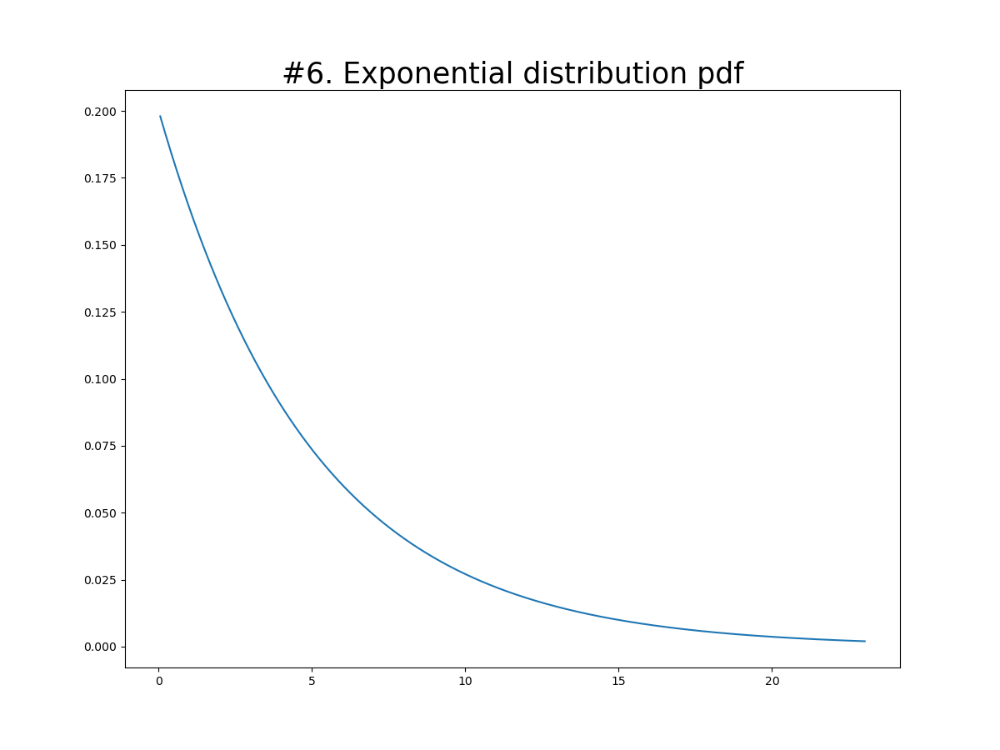
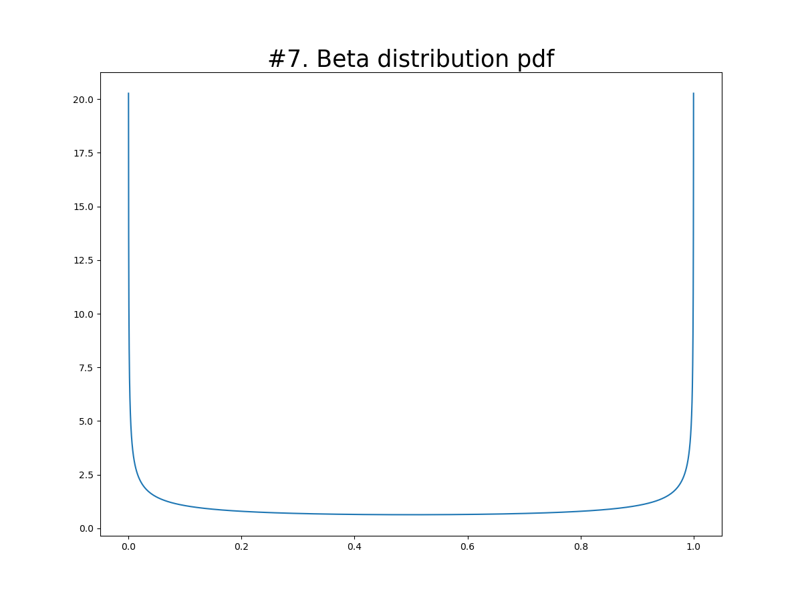
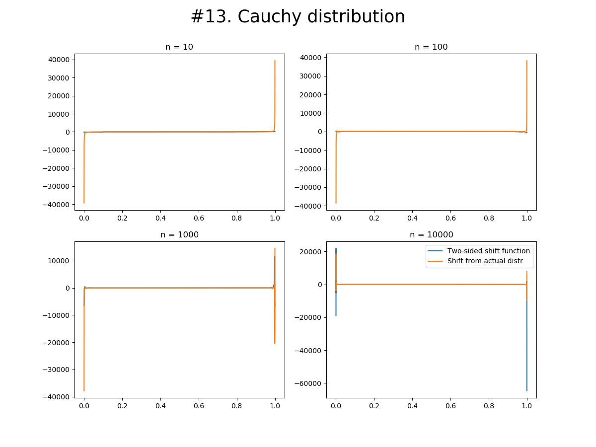

# Shift Functions Experiment

## Run

```shell
pip install -r requirements.txt
python3 main.py
```

Желательно запускать из `IDE`([например](https://www.jetbrains.com/pycharm/)).

## Эксперимент

Структура:

* `distribution.py` -- тут лежат удобные классы-обертки над различными распределениями из `scipy.stats`.
* `shift.py` -- здесь лежат вспомогательные функции для оценки квантилей и вычисления функций сдвига.
* `main.py` -- основной код, который нужно запускать.

В `shift.py` есть функция, возвращающая `shift_function` -- функцию сдвига между двумя выборками,
а также `shift_from_actual_function` -- функция сдвига выборки относительно заранее известного распределения.

Набор распределений, из которых берутся тестовые выборки с детерминированным сидом, можно увидеть в мейне:

```
np.random.seed(239)

distributions = [
     Normal(0, 1),
     Normal(-20.39, 3.22),
     Normal(13, 31.4),
     SkewNormal(10, 0, 1),
     Exponential(0, 1),
     Exponential(0, 5),
     Beta(0.5, 0.5),
     Beta(5, 1),
     Beta(1, 3),
     Beta(2, 2),
     Beta(2, 5),
     Cauchy(0, 1),
     Cauchy(15, 12.34),
     DoubleGamma(5),
     DoubleWeibull(6)
 ]
```

Из интересного, `SkewNormal` -- скошенное нормальное, Бета-распределение с различными параметрами, Коши с тяжелыми
хвостами и последние два бимодальные.

По заданию требовалось считать сдвиг между одной выборкой и распределением, но я также считаю настоящий `shift_function`
между двумя выборками из одного распределения(и здесь будет две погрешности, которые могут дополнять или компенсировать
друг друга), потому что это более приближенный к жизни сценарий: есть только выборки, а не априорные распределения и
заранее посчитанные квантили.

Для каждого распределения для четырех разных значений размера выборки `n`(`10, 100, 1000, 10000`) происходит следующее:

* Берутся две выборки и считается `shift_function` между ними.
* Считается `shift_from_actual_function` между первой выборкой и известными аналитически квантилями распределения.
* Графики получившихся функций, а также `pdf` распределения, сохраняются, и их можно увидеть в папке `img`.

### Общие выводы из графиков.

* Достоверный интервал квантилей зависит от класса распределения.
* Достоверный интервал квантилей зависит от размера выборки.
* Определить достоверный интервал можно таким образом: выбираем `\alpha`, равную например `0.05`, и отбрасываем квантили
  с `\alpha` наибольшими значениями функции сдвига(по модулю), то есть берём только наименьшие `1-\alpha`. Чем размер
  выборки больше, тем меньше нужно брать `\alpha`.
* Также можно для каждого класса распределений найти критические точки(часто это 0 и/или 1; у бимодальных еще между
  модами) и выкидывать интервал `\alpha` квантилей вокруг них.
* Можно выкидывать не процент худших квантилей, а установить порог на отклонения функции от нуля: достоверный квантиль,
  если функция в этой точке меньше некоторого `threshold`.
* Для разных размеров выборки можно построить графики зависимости `\alpha` от `threshold` и выбирать нужную константу,
  смотря уже на них. Эта функция быстро дорастет до `0.9+`(так как у большинства квантилей отклонение от нуля
  минимальное), а потом будет расти очень медленно(когда останутся только выбросы). Вот эту точку можно найти и
  перехватить.
* Доверительные интервалы далее выведены эмпирически. Если принять хороший способ и честно посчитать, то можно
  что-нибудь и формализовать.

## Выводы по классам

### Нормальное распределение




* Достоверные интервалы не зависят от сдвига и скейла(если смотреть относительный прирост).
* Выбросы только по краям.
* Начиная с размера выборки 100 можно доверять центральным `90-95%` квантилей.

### Скошенное нормальное распределение


* Небольшой выброс в начале, большой в конце, поэтому доверительный интервал можно чуть-чуть скосить влево.
* На `n = 100` ситуация намного хуже, чем в нормальном распределении; дальше всё стабилизируется.
* Начиная с размера выборки 1000 можно доверять центральным `90-95%` квантилей.

### Экспоненциальное распределение





* Достоверные интервалы не зависят от сдвига и скейла(если смотреть относительный прирост).
* Большой выброс только в конце, чем дальше, тем хуже.
* Колебания в конце хуже, чем на краях нормального распределения, поэтому доверяем первым`85-90%` квантилей.

### Бета-распределение




* Нужно сразу смотреть на форму `pdf`, потому что в зависимости от параметров распределение очень сильно меняется
* При разных `\alpha` и `\beta` большие различия могут появляться и в начале(`#8`), и в конце(`#9`, `#11`), и наоборот
  успокаиваться по краям, а бушевать посередине, хоть и с не очень большой относительной амплитудой(`#7`); или быть
  примерно одинаково расходящимся везде(`#10`), хоть и снова амплитуда небольшая.
* Возможно тут стоит посмотреть в сторону погрешности вычислений вещественных чисел, а в идеальном мире всё было бы
  ровно(вообще такая хаотичность похожа на погрешность компьютера).
* Доверительные интервалы стоит рисовать отдельно для каждой пары параметров.

### Распределение Коши




* Распределение с тяжелыми хвостами очевидно улетает по краям.
* Нарисовал на лог шкале модуль(в смысле абсолютное значение) функции сдвига.


* По-хорошему надо посчитать это всё с бо́льшей точностью, а то на этом графике не очень понятно, насколько влияет
  погрешность в вычислениях(а сомнения, что влияют, есть).
* Числа в выборке от 0 до 0.3(примерно; на графике `#12`), а тут уже рядом с центром расхождения порядка 0.1
  (на `n=10000`, а на 100 везде всё плохо), а по краям вообще в космосе.
* Очень сложно доверять хоть чему-нибудь, но если считать с большей точностью и с большим `n` центральной половине
  квантилей можно и довериться.

### Бимодальные распределения


* Двойное гамма-распределение точечно отклоняется в начале, середине и конце. Причем очень сильно. Поэтому не доверяем
  по `5-10%` во всех трех местах.
* У распределения Вейбулла получше по краям, потому что моды находятся ближе к ним и дальше друг от друга, что образует
  большой прорыв в середине.
* Между модами очень сложно доверять, и это логично.
* Вообще чем ближе к большой плотности, тем больше доверия. Можно подумать над этим с формальной точки зрения.

## References

1. https://garstats.wordpress.com/2016/07/12/shift-function/
2. https://aakinshin.net/posts/shift-and-ratio-functions/
3. https://projecteuclid.org/euclid.aos/1176342662
